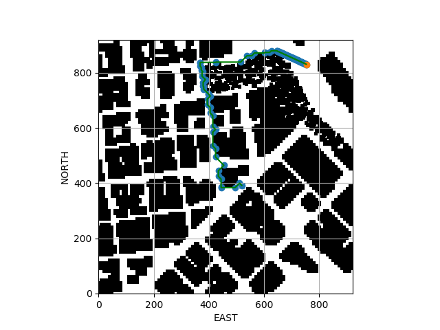
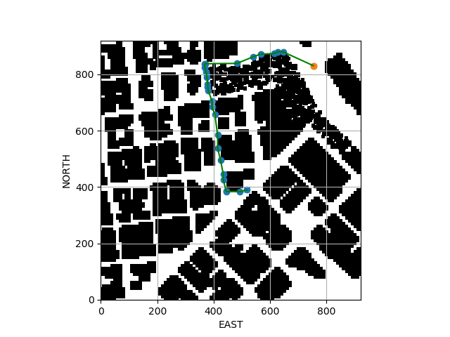

## Project: 3D Motion Planning

### Running the Code

To run the code in debug mode with Bresenham ray tracing -

```console
python motion_planning.py --debug True --prune bresenham_prune
```
To run the code with Collinearity based pruning -

```console
python motion_planning.py --debug True
```
Adding advanced methods like `Random Sampling` and `RRT` is work in progress

To understand functionality of the drone better, you can look at the udacidrone API documentation [here](https://udacity.github.io/udacidrone/docs/drone-attributes.html).

### Explaining the Starter Code

the `path_plan` function performs the following tasks -
1. **Create the Grid** - This is done using the `create_grid` function at the specified altitude that uses the obstacles in colliders.csv to determine the total grid size based on the farthest corners for all the obstacles with an additional safety distance used as a guard-band.

2. **run Astar on the grid from start to goal** - Astar implementation exists in `planning_utils.py`. The default heuristic uses 2D Euclidean distance for the cost. The Astar algorithm returns a path from `start` to `goal`.

3. ** Send the path as waypoints for the drone to execute** - The path generated by running Astar is then sent as waypoints for the drone to execute.


### Implementing the Path Planning Algorithm

#### 1. Set the global home position
The global home position is done by extracting the latitude and the longitude from the `colliders.csv` file and then using the `set_home_position` function to set the Global Home of the drone.

The following code snippet shows the implementation -

```python
 with open("colliders.csv", 'r') as f:
     co_ords = f.readline().split(",")
     lat = float(co_ords[0].split(" ")[1])
     lon = float(co_ords[1].split(" ")[2])
     if self.debug:
         print("Reading from file...")
         print("Lat:{0:5.2f}     Lon: {1:5.2f}".format(lat, lon))

self.set_home_position(lon, lat, 0.0)

```

#### 2. Set the current local position
The current local position gets set automatically based on the setting of the global home position.

However, to extract the current local position, one can make use of the `global_to_local` function in the udacidrone API.

The following example shows its usage -

```python
current_local_position = global_to_local(current_global_position, self.global_home)
```

#### 3. Set grid start position from local position
The `create_grid` function creates an offset in the north and east locations in terms of local_position.

The start position of the drone can be adjusted to its current location when the drone global home location is set by subtracting the offset from the local position value as shown below -

```python
north = self.local_position[0]
        east = self.local_position[1]
        grid_start = (int(north - north_offset), int(east - east_offset))
```

#### 4. Set grid goal position from geodetic coords
This uses the `global_to_local` function again. The code will take user provided input for latitude, longitude and altitude and convert that to the local position before setting it as the goal location.

```python
target_north, target_east, _ = global_to_local((self.target_lon, self.target_lat, 0.0), self.global_home)
        grid_goal = (int(target_north - north_offset), int( target_east - east_offset))
```

#### 5. Modify A* to include diagonal motion (or replace A* altogether)
To include diagonal motion, these were added to the set of possible Actions with a cost of `sqrt(2)` associated with the diagonal motion.

Additionally, checks for validity were added as well which would get reflected when it gets used in the Astar algorithm

```python
diag_cost = np.sqrt(2)
...
...
WEST = (0, -1, 1)
EAST = (0, 1, 1)
NORTH = (-1, 0, 1)
SOUTH = (1, 0, 1)
NORTH_WEST = (-1, -1, diag_cost)
NORTH_EAST = (-1, 1, diag_cost)
SOUTH_WEST = (1, -1, diag_cost)
SOUTH_EAST = (1, 1, diag_cost)
```

`Checking the validity of the diagonal motions`

```python
if x - 1 < 0 or y - 1 < 0 or grid[x-1, y-1] == 1:
    valid_actions.remove(Action.NORTH_WEST)
if x - 1 < 0 or y + 1 > m or grid[x-1, y + 1] == 1:
    valid_actions.remove(Action.NORTH_EAST)
if x + 1 > n or y - 1 < 0 or grid[x+1, y-1] == 1:
    valid_actions.remove(Action.SOUTH_WEST)
if x + 1 > n or y + 1 > m or grid[x+1, y+1] == 1:
    valid_actions.remove(Action.SOUTH_EAST)
```

#### 6. Prune the waypoints
Two separate mechanisms are provided.
1. `simple_prune` - This checks the collinearity of 3 points and adds them up to bring
2. `bresenham_prune` - This performs a ray-tracing operation between the last point added to the pruned_path and the current path being examined.

The `bresenham_prune` provides much better final performance, as it reduces the number of twists and turns that the drone has to make which matter a lot in terms for the end performance.

The code below shows the implementation for each -

`simple_prune which performs a 2D collinearity check between 3 points`
```python
def simple_prune(grid, path, debug):
    """ Uses slope to prune points which are already collinear"""
    start_time = time.time()
    total_points = len(path)
    pruned_path = [path[0]]
    start_point = path[0]

    for i in range(total_points-2):
        isCollinear = collinearity_check(start_point, path[i+1], path[i+2])
        if not isCollinear:
            # Add that point to the pruned path as well
            pruned_path.append(path[i+1])
        # Update the start point
        start_point = path[i + 1]
    pruned_path.append(path[total_points -1])
    stop_time = time.time()
    if debug:
        print("Time taken for pruning the path was: {0:5.2f}".format(stop_time - start_time))
        print("The total number of points in the pruned path is: {}".format(len(pruned_path)))

    return pruned_path
```

`bresenham_prune which performs a ray tracing operation `

```python
def bresenham_prune(grid, path, debug):

    start_time = time.time()
    pruned_path = [path[0]]
    total_points = len(path)
    start_point = path[0]

    for i in range(total_points - 2):
        points = bresenham(start_point[0], start_point[1], path[i+2][0], path[i+2][1])
        if any(grid[point[0], point[1]] == 1 for point in points):
            pruned_path.append(path[i+1])
            start_point = path[i+1]

    pruned_path.append(path[-1])
    stop_time = time.time()

    if debug:
        print("Time taken for pruning the path was: {0:5.2f}".format(stop_time - start_time))
        print("The total number of points in the pruned path is: {}".format(len(pruned_path)))

    return pruned_path
```


### Executing Flight Paths

Both the `Astar` modification and the addition of path pruning algorithms provides valid solutions in the grid space.

A short performance evaluation is provided below. This table shows the number of points in the path for each algorithm  -

| Goal | Astar | Simple Prune | Bresenham Prune |
|------|-------|--------------|-----------------|
|(831,752) @ 20| 517  | 88  | 3  |
| (500,500) @ 50 | 186  |  16 | 4  |
| (831, 752) @ 5  | 912  | 148  |  128 | |

Example Paths taken for the same simulation in two different cases

`Simple Prune using a collinearity test `


`Bresenham Prune `


As you can see from the two images, the simple prune method has a lot more points in the path compared to the Bresenham prune implementation.

A more detailed performance evaluation is warranted with processing time and distance travelled taken into account as well. This will be added in the coming weeks once more sophisticated implementations are enabled.

# Work in Progress

1. Planning using `Random Sampling` or `RRT`

2. `Trajectory Generation` - The trajectory generated by the `Astar` algorithm consists of lines, which make it hard for the drone to make smooth transitoins. Minimum Snap trajectory and other trajectory generations and being reviwed and will be implemented at a later time.  

3. Implement with Replanning as one of the features
